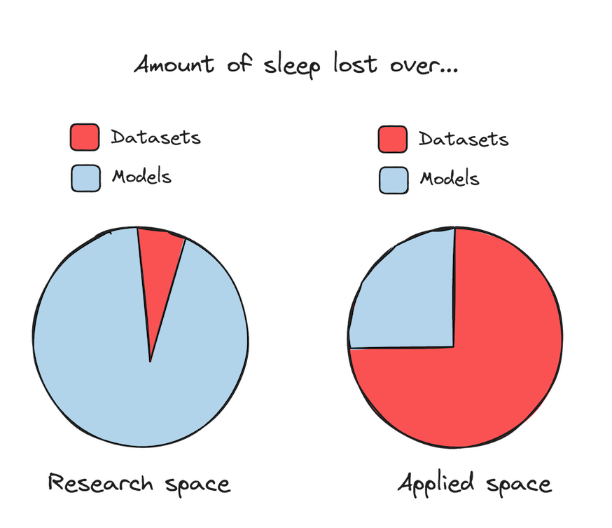
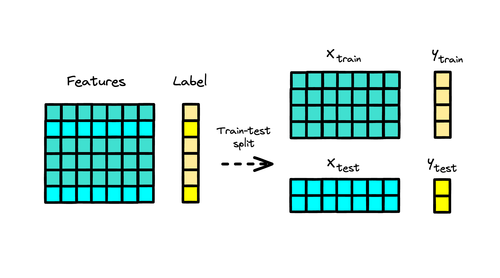
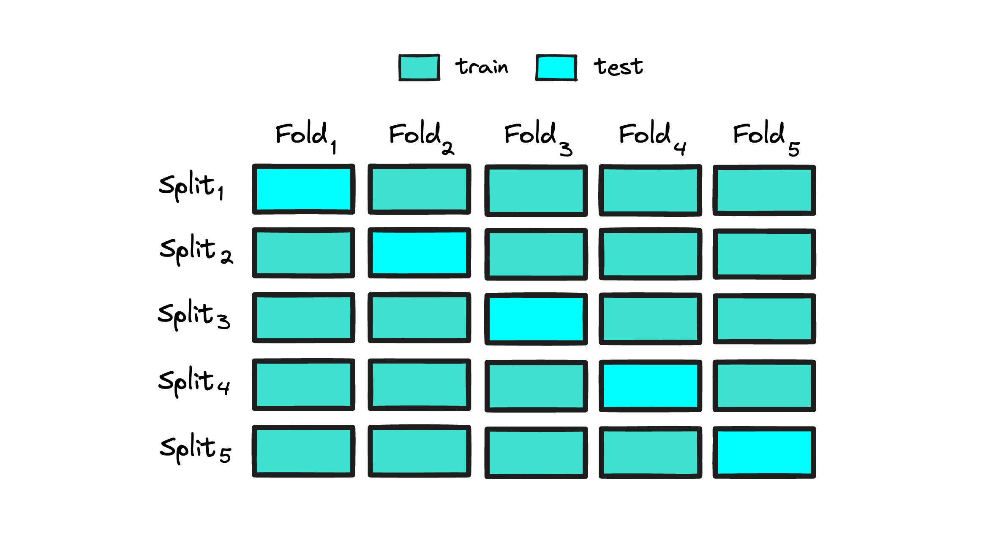

# Datasets

Many books and online tutorials start with a neat, static tabular dataset. However, when it comes to building predictive systems for lending business, we normally deal with data that's far from perfect. In retail banking, it's messy, unstructured, and constantly changing. The very first question people ask when they join a project is, "Where's the dataset?" (also: "Is our training data the “right” data set?").

The simple truth is there's usually no readily available dataset. It goes without saying that it's a practitioner's job (not another person's) to roll up their sleeves, collect the data, and get it in shape to solve the problem. Preparing a dataset often means sampling from all possible real-world data to create training data, and this is no trivial task as many things can go off track in the early stages of the project.

When developing a minimum viable dataset for modeling credit risk, you should be extremely motivated to understand how data works to validate the usefulness of your problem framing and your data. As a common saying goes, "garbage in - garbage out": low-quality data, not subpar algorithmic performance, serves as a common source of risk assessment errors.

When preparing data for predictive modeling purposes, it's essential to divide it into training and hold-out (test) sets. The training data is used to estimate a scoring function, while the hold-out data is reserved for monitoring performance on unseen data. Another way to create trainining and hold-out samples is to use a cut-off date to create an out-of-time testing data.

Another widely used approach is cross-validation, where the data is split into training and hold-out sets using a specified number of folds. This technique is valuable not only for model training but also for hyperparameter optimization. Cross-validation allows performance evaluation on each fold, and the results are averaged to find hyperparameters that enhance the model's performance.

In the text that follows, you will discover resources for working with credit risk datasets and access links to publicly available credit risk data sources to get started. The aim here isn't to delve deep into the technicalities of building default flags or performing hands-on feature engineering. Instead, the focus is to provide you with a foundational perspective on ML underwriting models that you can further expand through additional offline and online reading.

You will also find notebooks with processing dataframes using tools like Pandas and Polars, explore the basics of NumPy and a range of Python's built-in functions that may be instrumental to modeling your domain of specialty.

<code> ... </code>

## Publicly Available Datasets

Below you may find some known and not so well known real-world credit risk datasets that can be used for training and benchmarking performance of credit-risk models (in no particular order). Some of these datasets (in original or synthesized form) will be used throughout this guide.

### Tabular Data

- <a href="https://community.fico.com/s/explainable-machine-learning-challenge">HELOC dataset - FICO</a>
  - For more information about the dataset, please see: <a href="https://github.com/Trusted-AI/AIX360/blob/master/examples/tutorials/HELOC.ipynb">AIX360 Credit Approval Tutorial</a>.

- <a href="https://www.kaggle.com/c/GiveMeSomeCredit">Give Me Some Credit - Kaggle</a>

- <a href="https://www.kaggle.com/code/hafidhfikri/loan-approval-prediction">Loan Approval Prediction - Kaggle</a>

- <a href="https://capitalmarkets.fanniemae.com/credit-risk-transfer/single-family-credit-risk-transfer/fannie-mae-single-family-loan-performance-data">Fannie Mae Single-Family Loan Performance Data - Fannie Mae</a>
  - For more details about the datasets and their processing, please see: <a href="https://capitalmarkets.fanniemae.com/media/9066/display">Loan Performance Data Tutorial</a>.

- <a href="https://www.openintro.org/data/index.php?data=loans_full_schema">Loan Data - Lending Club</a>
  - For more details about the datasets and their processing, please see: <a href="https://www.dataquest.io/blog/machine-learning-preparing-data/">Data Cleaning and Preparation for Machine Learning - dataquest.io</a>.

- <a href="https://www.bondora.com/en/public-reports#dataset-file-format">Loan dataset - Bondora</a>

- <a href="https://dataverse.harvard.edu/dataset.xhtml?persistentId=doi:10.7910/DVN/GWOTGE">Credit Scoring data - Harvard Dataverse</a>

- <a href="https://data.world/lpetrocelli/czech-financial-dataset-real-anonymized-transactions">1999 Czech Financial Dataset - PKDD'99 Discovery Challenge</a>

### Graph Data

- <a href="https://dataverse.harvard.edu/dataset.xhtml?persistentId=doi:10.7910/DVN/KULOS8">GraphXAI - Harvard Dataverse</a>
  - <a href="https://github.com/mims-harvard/GraphXAI/tree/main/examples">Helpful examples</a>
  - <a href="https://github.com/chirag126/nifty">Code</a>

- <a href="https://github.com/chirag126/nifty/tree/main/dataset">Credit and German Graph Data</a>
  - The German credit graph represents clients in a German bank connected with 10,000 nodes based on the similarity of their credit accounts. The task is to classify clients into good vs. bad credit risks, considering clients' gender as the sensitive attribute.
  - The credit defaulter graph features 30,000 nodes representing individuals connected based on the similarity of their spending and payment patterns. The task is to predict whether an individual will default on the credit card payment or not while considering age as the sensitive attribute.

<b>More resources to read</b>  Explore additional resources and references for in-depth understanding of the topics covered in this section.

   
  

  <a href="https://www.fast.ai/posts/2017-11-13-validation-sets.html">How (and Why) to Create a Good Validation Set</a> 
  

  

  <a href="https://ydata.ai/resources/combining-great-expectations-with-fabric">Combining Great Expectations with Fabric: Create Better ML datasets</a> 
  

  

  <a href="https://scikit-learn.org/stable/auto_examples/preprocessing/plot_all_scaling.html">Compare the Effect of Different Scalers on Data with Outliers</a> 
  

  

  <a href="https://scikit-learn.org/stable/auto_examples/impute/plot_missing_values.html#sphx-glr-auto-examples-impute-plot-missing-values-py">Imputing Missing Values Before Building an Estimator</a> 
  

  

  <a href="https://www.liebertpub.com/doi/abs/10.1089/big.2021.0067?journalCode=big">Explaining Predictive Model Performance: An Experimental Study of Data Preparation and Model Choice</a> 
  

  

  <a href="https://journals.plos.org/plosone/article?id=10.1371/journal.pone.0237009">The Data Representativeness Criterion: Predicting the Performance of Supervised Classification based on Data Set Similarity</a> 
  

