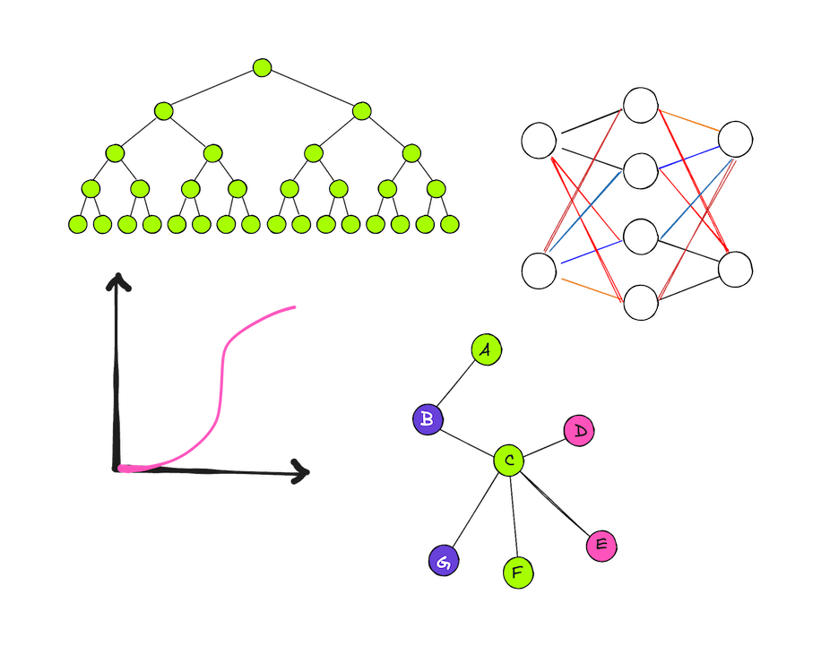
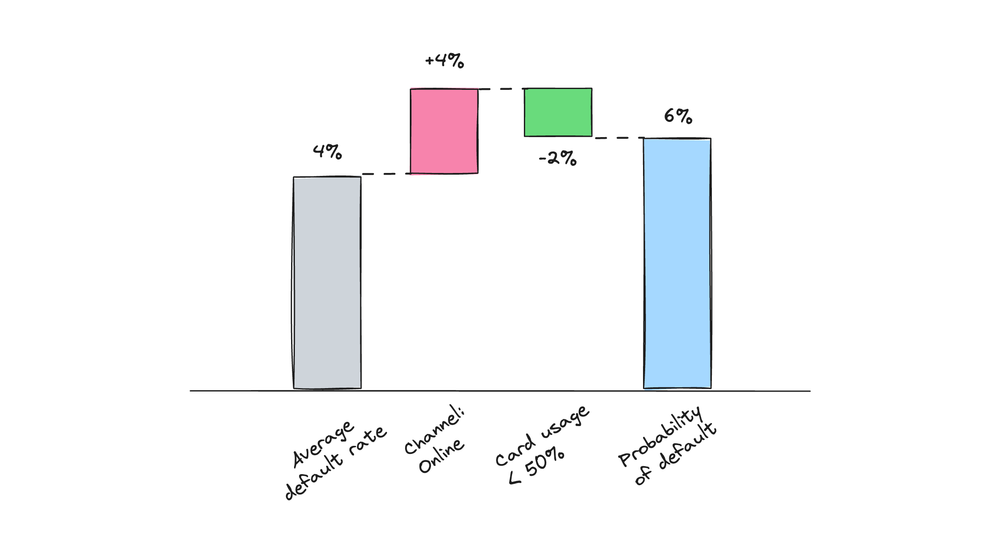
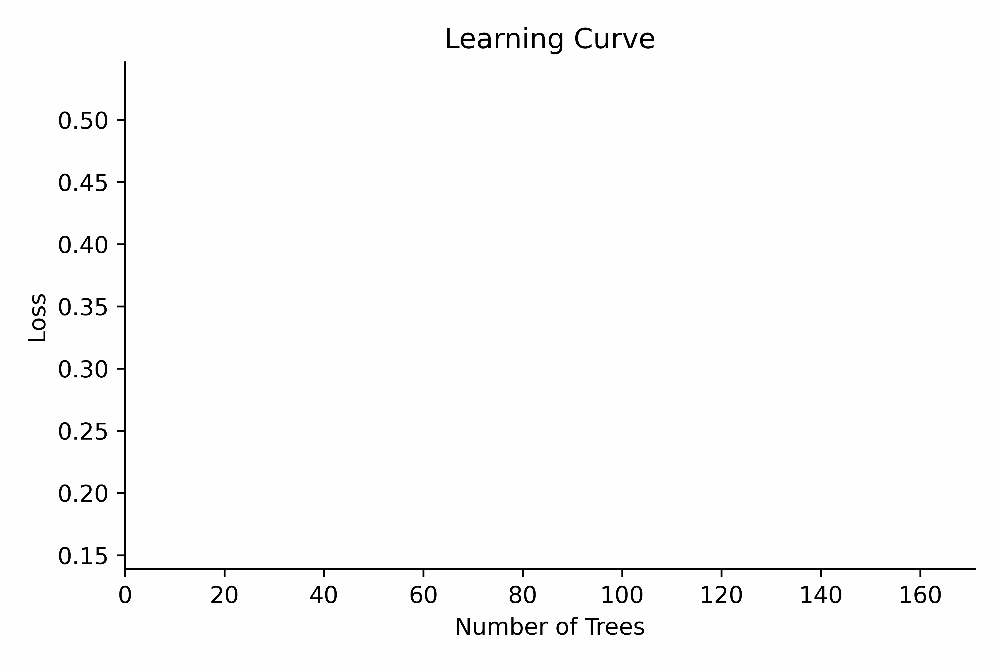

# Models

<b>Credit scoring</b> is a high-stakes use of machine learning in the financial services industry. It has transformed consumer lending and is used for tasks like evaluating loan applications, assessing ,loan performance, segmenting risk, and determining pricing. A credit scoring system can be understood as the totality of tools, processes, and systems used for the estimation of the credit risk.

A <b>credit score</b> is a measure of the likelihood of default risk appearing in the lending book. It's often expressed as a probability, converted into a scorecard or mapped to a rating, or "blended" with other scores in a modular scoring system. When we talk about credit scores, most of the time a higher score means a lower probability of default (e.g., 700) and vice versa (e.g. 500 means a high default probability).

<blockquote>

A practitioner's goal is to contextualize the model with domain knowledge in the area credit risk and direct it towards the outcomes they aim for, and there are multiple ways to do so.

</blockquote>

The most common method to build a scoring model is using <b>Logistic Regression</b>, often advanced via a supervised binning technique called <b>Weight-of-Evidence (WOE)</b>. WOE typically represents how well the evidence either weakens or reinforces a hypothesis about probability of default for a given group versus the average. A "gold standard" scoring model produced with linear techniques is an additive model with a limited number of main effects. 

Such models are relatively easy to develop and validate. At the same time, such linear models do not handle interactions present in the data well and this is where other types of machine learning models for credit risk have proven useful.

This simplified example showns how we can use probabilities to explain the logic of scorecard building with WOE (actual score estimation is performed in the log odds space).

With growing amounts of financial transactions data, we can easily come across underfitting and overfitting model behavior often denoted as the <b>bias-variance trade-off</b>. When a model underfits the data, it demonstrates high bias failing to capture the relationships in the data. Bias can be reduced by using more complex, non-linear models or increasing the amount of training data. Conversely, overfitting occurs when a model exhibits high variance, resulting in the inability to generalize well beyond the training data. Regularization techniques are often employed to mitigate overfitting by constraining model complexity.

<b>XGBoost</b>, a powerful gradient boosting algorithm, excels in handling complex tabular data with many unique interactions. Its superior performance on tabular datasets has made it a popular choice for a large set of problems. Binary classification trees are constructed sequentially, forming an ensemble of weak learner trees (sometimes even as small as decision stumps) with the objective to minimize loss. In the context of binary classification, unless specified differently, <b>XGBoost</b> uses a logistic loss (Log Loss) as an objective function, which allows to interpret its leaf weights as log odds similar to WOE bins.

In contrast, emerging neural networks for structured data, e.g. <b>TabNet</b> and <b>DeepTables</b>, aim to leverage deep learning capabilities in the finance domain. Some of the interesting benefits of these models is their ability to be trained on unlabeled data and built-in interpretability methods that are geared towards industry requirements. These models strive to capture complex relationships within structured datasets and offer an alternative to methods like <b>XGBoost</b> or Microsoft's <b>LightGBM</b>.

<b>Graph-neural networks (GNNs)</b> stand out as promising candidates for modeling relationships between customers with similar risk characteristics or connected through a certain payment network or a platform. Graph data has the potential to enhance the accuracy of risk assessments by incorporating structures that are not visible in tabular datasets.

This chapter looks at industry best practices and relevant research on credit scoring. Notebooks cover some examples of starting points of scoring model development using Weight-of-Evidence (WOE) logistic regression, XGBoost models, and neural networks for tabular data.

<code> ... </code>

## Linear Models

Building Credit Scorecards using SAS and Python

<b>The SAS Data Science Blog</b> 

- [Read Here](https://blogs.sas.com/content/subconsciousmusings/2019/01/18/building-credit-scorecards-using-statistical-methods-and-business-logic/)
  - This blog post provides a step-by-step guide to building credit scorecards using the Weight-of-Evidence (WOE) logistic regression approach with SAS and Python.

 Automating Interpretable Machine Learning Scorecards

<b>Moody's Analytics</b> 

- [Read Here](https://www.moodysanalytics.com/-/media/article/2020/Automating-Interpretable-Scorecards.pdf)
  - This paper compares logistic regression with supervised binning to other popular machine learning methods. It shows that the modified logistic regression offers similar performance to challenger ML models while maintaining interpretability.

<b>More resources to read</b>  Explore additional resources and references for in-depth understanding of the topics covered in this section.

   
  

  <a href="http://www.m-hikari.com/ams/ams-2014/ams-65-68-2014/zengAMS65-68-2014.pdf">A Necessary Condition for a Good Binning Algorithm in Credit Scoring</a> 
  

  

  <a href="https://gnpalencia.org/optbinning/">OptBinning: The Python Optimal Binning library</a> 
  

  

  <a href="https://onlinelibrary.wiley.com/doi/book/10.1002/9781118548387">Applied Logistic Regression</a> 
  

  

  <a href="https://link.springer.com/book/10.1007/978-3-319-19425-7">Regression Modeling Strategies: With Applications to Linear Models, Logistic and Ordinal Regression, and Survival Analysis</a> 
  

  <a href="https://dasha.ai/en-us/blog/log-loss-function">Log Loss Function - Dasha.AI</a> 
  

  

  <a href="https://www.analyticsvidhya.com/blog/2022/02/decoding-logistic-regression-using-mle/">Decoding Logistic Regression using MLE - Analytics Vidhya</a> 
  
 
  

  <a href="https://www.data-automaton.com/2018/01/24/logistic-regression/">Logistic Regression - Data Automaton</a> 
  

  <a href="https://www.alpha-quantum.com/blog/logistic-regression/logistic-regression-from-scratch/">Logistic Regression from Scratch - Alpha Quantum</a> 
  

  

## Tree-Based Models

Machine Learning in Credit Risk Modeling: Efficiency without Compromising Explainability

<b>James - Credit Risk AI</b> 

- [Read Here](https://www.slideshare.net/YvanDeMunck/machine-learning-in-credit-risk-modeling-a-james-white-paper)
  - This forward-looking white-paper provides an overview of machine learning applications in Credit Risk Modeling. It covers linear models, decision trees, and ensemble methods (Random Forest and Gradient Boosting) in the context of credit risk applications.

Machine Learning in Retail Credit Risk: Algorithms, Infrastructure, and Alternative Data

<b>NVIDIA</b> 

- [Watch Here](https://www.nvidia.com/en-us/on-demand/session/gtcspring21-s31327/)
  - This lecture explores how machine learning is reshaping credit risk models, including new methods for transparent ML in highly regulated environments, the impact of deep learning on alternative financial data, and the acceleration of model development using on-premises GPU computing.

Machine Learning Approach for Credit Scoring

<b>Illimity</b> 

- [Read Here](https://arxiv.org/abs/2008.01687)
  - This paper proposes an end-to-end corporate rating model development methodology using machine learning. It features a core model architecture with a Light-GBM classifier, a probability calibrator, and a rating attribution system. It's a must-read for understanding the potential of ML in Credit Risk Modeling. You can also find an example of the calibration method [here](https://gdmarmerola.github.io/probability-calibration/) based on Facebook's seminar paper [Practical Lessons from Predicting Clicks on Ads at Facebook](http://quinonero.net/Publications/predicting-clicks-facebook.pdf).

<b>More resources to read</b>  Explore additional resources and references for in-depth understanding of the topics covered in this section.

   
  

  <a href="https://projecteuclid.org/journals/statistical-science/volume-16/issue-3/Statistical-Modeling--The-Two-Cultures-with-comments-and-a/10.1214/ss/1009213726.full">Statistical Modeling: The Two Cultures</a> 
  

  

  <a href="https://doi.org/10.1214/aos/1016218223">Additive Logistic Regression: a Statistical View of Boosting</a> 
  

  

  <a href="https://arxiv.org/abs/1603.02754">XGBoost: A Scalable Tree Boosting System</a> 
  

  

  <a href="https://everdark.github.io/k9/notebooks/ml/gradient_boosting/gbt.nb.html">Demystify Modern Gradient Boosting Trees: From Theory to Hands-On Examples</a> 
  

  

  <a href="https://gabrieltseng.github.io/posts/2018-02-25-XGB/">Gradient Boosting and XGBoost</a> 
  

  

  <a href="https://gabrieltseng.github.io/appendix/2018-02-25-XGB.html">Appendix to Gradient Boosting and XGBoost</a> 
  

  

  <a href="https://cengiz.me/posts/extreme-gradient-boosting/">How Does Extreme Gradient Boosting (XGBoost) Work?</a> 
  

  

  <a href="https://zpz.github.io/blog/gradient-boosting-tree-for-binary-classification/">Understanding Gradient Boosting Tree for Binary Classification</a> 
  

  

  <a href="https://homes.cs.washington.edu/~shapiro/EE596/notes/InfoGain.pdf">Information Gain</a> 
  

  

  <a href="https://cran.r-project.org/doc/contrib/Sharma-CreditScoring.pdf">Guide to Credit Scoring in R</a> 
  

## Deep Learning Models

Predicting Consumer Default: A Deep Learning Approach

<b>NBER</b> 

- [Read Here](https://www.nber.org/papers/w26165)
  - This NBER paper introduces a novel approach to probability of default (PD) modeling using a hybrid approach based on a deep neural network and gradient boosted trees. It utilizes a dataset from Experian and introduces the concept of Value Added (VA) for lenders and borrowers to measure the economic benefits of model adoption.

Deep Neural Networks for Behavioral Credit Rating

- [Read Here](https://www.ncbi.nlm.nih.gov/pmc/articles/PMC7824729/)
  - This paper presents a deep neural network model for behavioral credit risk assessment. It advocates for reconsidering regulatory requirements for model explainability to allow the usage of non-linear models for credit risk assessment. The paper also quantifies the difference in calibration accuracy for each class via the Brier score.

An End-to-End Deep Learning Approach to Credit Scoring using CNN + XGBoost on Transaction Data

- [Read Here](https://papers.ssrn.com/sol3/papers.cfm?abstract_id=4168935)
  - This paper argues that more detailed transactional information fed into models can enhance discriminatory power. Using machine learning algorithms to engineer features based on raw transactional data can reduce the application-behavioral performance gap in scoring models.

<b>More resources to read</b>  Explore additional resources and references for in-depth understanding of the topics covered in this section.

   
  

  <a href="https://link.springer.com/book/10.1007/978-1-4842-8692-0">Modern Deep Learning for Tabular Data: Novel Approaches to Common Modeling Problems</a> 
  

  

  <a href="https://www.bis.org/ifc/publ/ifcb49_49.pdf">A Robust Machine Learning Approach for Credit Risk Analysis of Large Loan Level Datasets Using Deep Learning and Extreme Gradient Boosting</a> 
  

## Graph-Based Models

Network Based Credit Risk Models

- [Read Here](https://www.tandfonline.com/doi/full/10.1080/08982112.2019.1655159)
  - This paper proposes an augmented logistic regression model that incorporates centrality measures derived from similarity networks among borrowers, deduced from their financial ratios. Inclusion of topological variables describing institutions centrality in similarity networks increases the predictive performance of the credit rating model.

Temporal-Aware Graph Neural Network for Credit Risk Prediction

- [Read Here](https://epubs.siam.org/doi/abs/10.1137/1.9781611976700.79?mobileUi=0)

  - The authors build the dynamic graphs to predict defaults by collecting multiple lending events of users and ordering the events by the lending time. The proposed model incorporates static, temporal, and structural features within a dynamic graph to predict the user's credit risk profile.

Loan Default Analysis with Multiplex Graph Learning

- [Read Here](https://dl.acm.org/doi/10.1145/3340531.3412724)
  - In this paper, the authors analyze transfers and social relations between users to define the number of defaulted neighbors for each user and then split users into three distinct groups. Both social and transaction relations achieve good performance since people with similar credit risk tend to gather together, and such a pattern can be naturally modeled via a graph model.

Every Corporation Owns Its Structure: Corporate Credit Ratings via Graph Neural Networks

- [Read Here](https://arxiv.org/abs/2012.01933)
  - This paper offers a new method named corporation-to-graph to explore the relations between features for corporate rating models. In this model, each corporation is represented as an individual graph from which feature-level interactions can be learned.

<b>More resources to read</b>  Explore additional resources and references for in-depth understanding of the topics covered in this section.

   
  

  <a href="https://blog.katanagraph.com/graph-neural-networks-for-credit-modeling">Graph Neural Networks for Credit Modeling - Katana Graph</a> 
  

  

  <a href="https://www.youtube.com/watch?v=rLCLIUmd9SE&ab_channel=MLOpsLearners">Graph Neural Networks: Theory, Problem, and Approaches</a> 
  

  

  <a href="https://aws.amazon.com/blogs/machine-learning/build-a-corporate-credit-ratings-classifier-using-graph-machine-learning-in-amazon-sagemaker-jumpstart/">Build a corporate Credit Ratings Classifier Using Graph Machine Learning in Amazon SageMaker JumpStart</a> 
  

