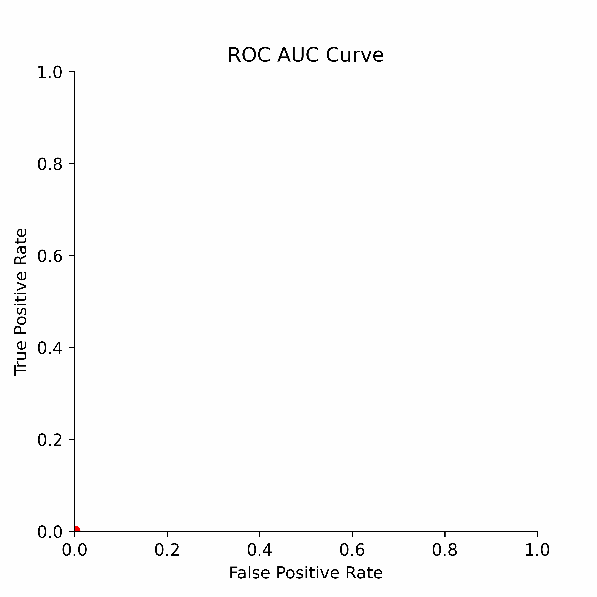
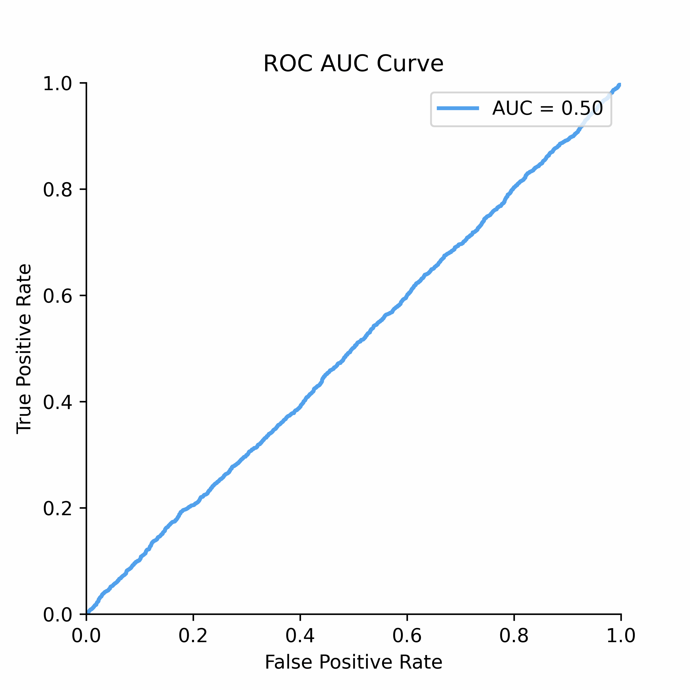
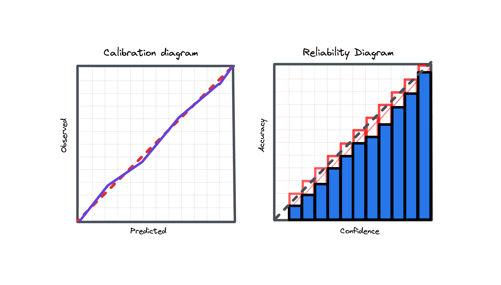

# Metrics

This chapter delves into the world of credit risk metrics. It explores a range of performance measures, with a primary focus on rank-ordering metrics ubiqitously used in credit risk analysis. Additionally, it reviews proper scoring rules, including the Brier score (mean squared error) and Log Loss, which are widely used in assessing binary classification model performance as well as a non-parametric method of Expected Calibration Error (ECE).

### Discrimination

The rank-ordering ability of credit risk models at separating good risk from bad risk has revolutionized financial services and lending in particular. When looking at the performance of models, practitioners usually rely on either the Gini score or AUC score in evaluating discriminatory power.

To understand how statistical discrimination works, ROC curve is instrumental. All of our observations are sorted decreasing by score (for example, predicted probability) and then at each unique threshold we evaluate the number of true positives and false positives. This approach to evaluating TPRs and FPRs at various classification thresholds allows to use this metric for imbalanced data.

Improved class separation is attained by achieving enhancements along the ROC curve, particularly through the presence of larger concave segments, which ultimately result in a higher AUC (Area Under the Curve) score.

ROC Curve and AUC score is less sensitive to the class imbalance problem unlike Precision-Recall and other confusion-matrix based metrics (e.g.,Accuracy, F1 score). This makes AUC score a good discrimination metric for credit risk where the numbers of defaulters are in general relatively low compared to non-defaulters.

The notebook provides practical examples and insights into the following rank-ordering metrics, essential for credit risk analysis:

1. <b>ROC Curve</b>: The Receiver Operating Characteristic (ROC) curve is a powerful tool for visualizing the performance of binary classifiers as the discrimination threshold varies.

2. <b>Gini Score</b>: The Gini score is a metric used to assess the discriminatory power of a model. The Gini score can be derived from AUC score (area under the ROC curve) as `Gini=AUC*2-1`.

3. <b>Profit Curve</b>: The profit curve is based on a constant cost-benefit matrix applied to a confusion matrix produced for each unique ROC Curve segment. It helps to evaluate the profitability of a model's predictions in evaluating the benefits of model use.

4. <b>Somers' D Score</b>: Somers' D is a rank correlation coefficient used to measure the strength and direction of association between ordinal variables, making it particularly relevant in credit risk analysis.

5. <b>Cumulative LGD Accuracy Ratio (CLAR)</b>: CLAR is a metric designed to assess the performance of credit risk models, considering loss given default (LGD) predictions.

<b>More resources to read</b>  Explore additional resources and references for in-depth understanding of the topics covered in this section.

   
  
 
    <a href="https://stats.stackexchange.com/questions/312780/why-is-accuracy-not-the-best-measure-for-assessing-classification-models">Why is Accuracy Not the Best Measure for Assessing Classification Models?</a> 
  

  
 
    <a href="https://hbiostat.org/blog/post/class-damage/index.html">Damage Caused by Classification Accuracy and Other Discontinuous Improper Accuracy Scoring Rules</a> 
  

  
 
  

    <a href="https://www.biorxiv.org/content/10.1101/743138v1.full">Beyond Accuracy: Measures for Assessing Machine Learning Models, Pitfalls and Guidelines</a> 
  

  

    <a href="https://docs.google.com/presentation/d/1IPXbEZpfrynjJMTXjI36rNGuPpOtY6_yJIrQOH6JBpI/edit#slide=id.p">Get the Best From Your Scikit-Learn Classifier</a> 
  
 
  
 
    <a href="https://www.routledge.com/ROC-Curves-for-Continuous-Data/Krzanowski-Hand/p/book/9781032477732">ROC Curves for Continuous Data</a> 
  

  
 
    <a href="https://carmenlai.com/2016/11/12/user-churn-prediction-a-machine-learning-workflow.html">User Churn Prediction: A Machine Learning Example</a> 
  

  
 
    <a href="https://blogs.sap.com/2019/06/20/machine-learning-with-sap-hana-r-evaluate-the-business-value/">Machine Learning with SAP HANA & R – Evaluate the Business Value</a> 
  

  
 
    <a href="https://github.com/dariyasydykova/open_projects/tree/master/ROC_animation">Animations with Receiver Operating Characteristic and Precision-Recall Curves</a> 
  

### Calibration

Model calibration is a fundamental yet often overlooked concept in predictive modeling, which is however not so much the case for credit risk models. This is so because a miscalibrated model may result in adverse selection of credit risk (failure of scores). Customers who received an inaccurate probability of default may be less likely to pay back than intended.

To understand calibration better, consider a scenario where a model predicts a default event with a 5% probability. This prediction suggests that, statistically, when the model makes such predictions multiple times, it should align with the actual outcome 5% of the time. If instead of 5% we actually observe 10% this means the model is miscalibrated, and several options exist to improve this including parametric and non-parametric approaches.

Model calibration is a critical property for predictive systems, ensuring that their output probabilities are reliable and aligned with actual occurrences for risk assessments.

This chapter explores some calibration metrics, which help determine how well a model's predicted probabilities align with the actual outcomes:

1. **Brier Score**: The Brier score, equivalent to the mean squared error, is a proper scoring rule used to assess the accuracy of probabilistic predictions and can be decomposed into calibration and refinement loss.

2. **Log Loss**: Log Loss, also referred to as Logarithmic Loss or Cross-Entropy Loss, serves as a widely-used evaluation metric for binary classification models. Log Loss essentially measures how closely the predicted probability aligns with the corresponding ground truth (0 or 1, typical for binary classification tasks). A lower Log Loss indicates superior model performance.

2. **Expected Calibration Error (ECE)**: Expected Calibration Error measures calibration in terms of weighted absolute differences between predicted probabilities and observed labels within bins. As per original paper, 10 equal width bins are used, however this analysis can be performed also on ROC segment level.

<b>More resources to read</b>  Explore additional resources and references for in-depth understanding of the topics covered in this section.

   

    <a href="https://proceedings.mlr.press/v70/guo17a/guo17a.pdf">On Calibration of Modern Neural Networks</a> 
  
 
  
 

    <a href="https://explained.ai/rf-importance/">Why Model Calibration Matters and How to Achieve It</a> 
  
 
  
 
    <a href="https://research.facebook.com/publications/practical-lessons-from-predicting-clicks-on-ads-at-facebook/">Practical Lessons from Predicting Clicks on Ads at Facebook</a> 
  

  
 
    <a href="https://johaupt.github.io/blog/downsampling_recalibration.html">Recalibration after Negative Sampling</a> 
  

