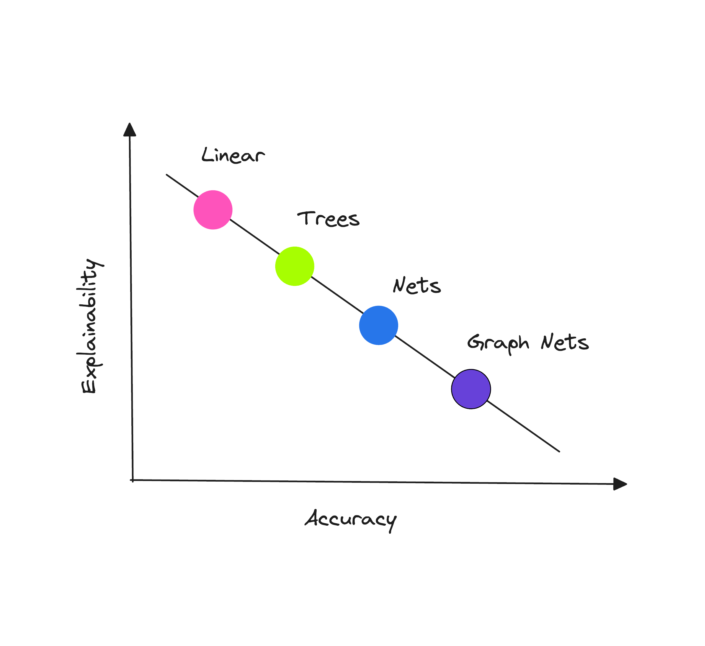

# Explainability

In the domain of credit scoring and predictive modeling in general, interpretability and explainability are often used interchangeably, both aimed at demystifying the workings of a machine learning model.

<b>Interpretability</b> helps us understand how an ML model works. It involves decomposing the model's inner workings, such as weights and features. For example, an economist can scrutinize a  model's parameters to comprehend its behavior and/or perform sensitivity analyses.

Machine learning models can often be seen as 'black boxes' that provide no insight on how they arrive at their predictions. This lack of transparency can be problematic in understanding the rationale behind decisions provided by a given model. This is where <b>explainability</b> comes into play by articulating the model's behavior in terms that are comprehensible to humans.

While linear models are naturally interpretable owing to their linear weights, tree-based models, particularly those of lower complexity, exhibit a capacity to craft easily comprehensible single-feature split conditions, lending themselves to human expert scrutiny.

However, the most interesting analysis often extends beyond feature importance and delves into feature interactions. To understand these complex relationships, both tree-based models and neural networks frequently rely on the application of external interpretability methods.

This chapter will cover the SHAP framework as the most well-grounded tool for the task as well as TabNet's internal explainer in the notebook supplementing this chapter.

<code> ... </code>

 
Explainable Machine Learning Models of Consumer Credit Risk

- [Read Here](https://papers.ssrn.com/sol3/papers.cfm?abstract_id=4006840)
  - This study demonstrates that the functionality of "black-box" machine learning models can be explained to a range of different stakeholders using the right tools. The approach is aimed at unlocking the future potential of applying AI to improve credit-risk models' performance.

 
Machine Learning Explainability in Finance: an Application to Default Risk Analysis

<b>Bank of England</b> 

- [Read Here](https://www.bankofengland.co.uk/working-paper/2019/machine-learning-explainability-in-finance-an-application-to-default-risk-analysis)
  - This paper proposes a framework for addressing the "black box" problem present in machine learning applications. The paper's goal is to develop a systematic analytical framework that could be used for approaching explainability questions in real-world financial applications.

 
Accuracy of Explanations of Machine Learning Models for Credit Decisions

<b>Bank of Spain</b> 

- [Read Here](https://papers.ssrn.com/sol3/papers.cfm?abstract_id=4144780)
  - A credit risk governance and regulation framework is proposed to evaluate the relevance of the input variables on a credit risk model’s prediction using post-hoc explanation techniques such as SHAP and permutation feature importance. The paper also highlights the potential of synthetic datasets for evaluating model interpretability tools.

 
Explaining and Accelerating Machine Learning for Loan Delinquencies

<b>NVIDIA</b> 

- [Read Here](https://developer.nvidia.com/blog/explaining-and-accelerating-machine-learning-for-loan-delinquencies/)
  - In this post, the authors discuss how to use RAPIDS to GPU-accelerate the end-to-end default modeling workflow: load and merge data, train a model to predict new results, and explain predictions of a financial credit risk problem using Shapley values.

 
Why Are We Using Black Box Models in AI When We Don’t Need To? A Lesson From an Explainable AI Competition

<b>MIT Press</b> 

- [Read Here](https://hdsr.mitpress.mit.edu/pub/f9kuryi8/release/8)
  - The article introduces Cynthia Rudin, a renowned machine learning expert, who advocates for transparency in machine learning models, drawing on her experiences with data science projects. In this article she reveals a surprising insight that different ML algorithms can yield similar accuracy under certain circumstances.

 
Stop Explaining Black Box Machine Learning Models for High Stakes Decisions and Use Interpretable Models Instead

- [Read Here](https://arxiv.org/abs/1811.10154)
  - This paper challenges the notion of a trade-off between accuracy and interpretability outlining several key reasons why explainable "black-boxes" should be avoided in high-stakes decisions. "Black-box" algorithms can still be useful in high-stakes decisions as part of the knowledge discovery process (for instance, to obtain baseline levels of performance), but they are not generally the final goal of knowledge discovery.

 
We Didn’t Explain the Black Box – We Replaced it with an Interpretable Model

<b>FICO</b> 

- [Read Here](https://arxiv.org/abs/1811.10154)
  - This guest blog was written by the winners of the FICO Recognition Award in the 2018 Explainable Machine Learning Challenge. The team's "glass-box" two-layer additive risk model turned out to be just as accurate (~74% accuracy) as the best "black-box" models.

<b>More resources to read</b>  Explore additional resources and references for in-depth understanding of the topics covered in this section.

   
  

  <a href="https://www.packtpub.com/product/interpretable-machine-learning-with-python/9781800203907">Interpretable Machine Learning with Python</a> 
  

  

  <a href="https://www.nature.com/articles/s41597-023-01974-x">Evaluating Explainability for Graph Neural Networks</a> 
  

  

  <a href="https://www.sciencedirect.com/science/article/pii/S0377221723005088">Interpretable Machine Learning for Imbalanced Credit Scoring Datasets</a> 
  

  

  <a href="https://docs.aws.amazon.com/whitepapers/latest/model-explainability-aws-ai-ml/interpretability-versus-explainability.html">Interpretability Versus Explainability - AWS Whitepaper</a> 
  

  

  <a href="https://www.insightpartners.com/ideas/responsible-ai-governance/">Investor POV: AI Governance and Responsible Use</a> 
  

  

  <a href="https://juanitorduz.github.io/interpretable_ml">Exploring Tools for Interpretable Machine Learning</a> 
  

  

  <a href="https://domino.ai/blog/shap-lime-python-libraries-part-1-great-explainers-pros-cons">SHAP and LIME Python Libraries: Part 1 - Great Explainers, with Pros and Cons to Both - domino.ai </a> 
  

