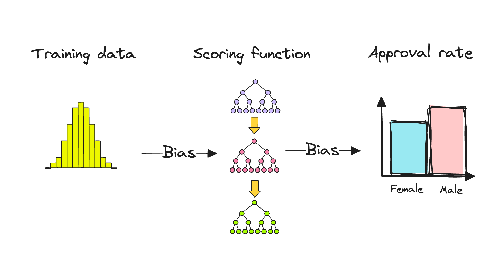
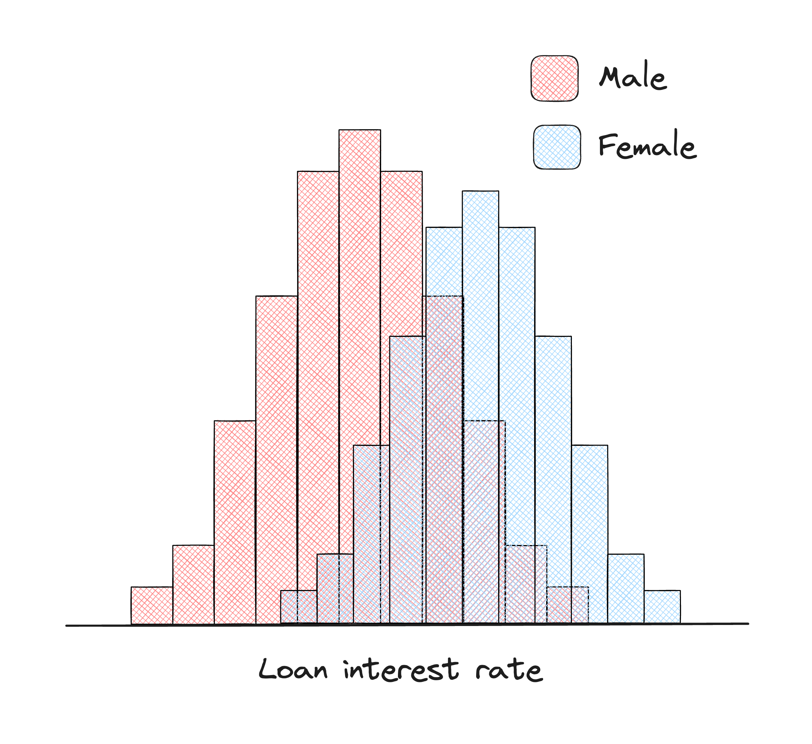

# Fairness

Credit-risk models learn from historical data and encode the past, which may be replete with biases. This creates a fair lending risk that may appear at different stages of a credit scoring model development. It's crucial to keep an eye on fair lending risk to ensure the models work fairly and don't perpetuate unfair practices in the area of loan decision-making. Examples of unfair lending practices are quite common, for example, <a href="https://link.springer.com/article/10.1007/s43681-022-00234-9">AI discrimination in mortgage applications study</a> showed that standard AI reduced the black applicants' probability of being approved for a loan from 46% to 33%.

To build fair and trustworthy credit scoring systems governing access to credit, we need models that are transparent and interpretable. This way, we can identify and fix any biases or unfairness before they cause harm. When we use machine learning for credit scoring, it's essential to make sure the system treats everyone fairly, giving everyone an equal chance at getting a loan.

After a model is built, bias in a credit-risk model can be assessed and corrected in the post-processing phase. This can be achieved by recalibrating the outputs, for example by making it easier for certain minority groups to get a positive model outcome by matching true positive and false positive rates across groups. Most of the fairness risk assessment methods are focused on binary classification, but forms of binning of continuous data may be used to analyze continuous financial behavior.

<b>Negative Sampling</b> 

Defining cut-offs is a crucial step before assessing fairness metrics. A cut-off can be understood as a threshold used to convert the model's probability output to a binary output of 0 or 1 (usually the choice is 0.5, but it may vary across problems and be dependent on class imbalance). Given a balanced distribution of positive and negative ground truth labels, establishing a threshold for classifying prediction as Y = 1  at a 50% probability is a convenient approach allowing to use a diverse set of classification metrics. In binary scenarios, we commonly regard the outcome Y = 1 as the "advantaged" result, for instance, representing being "approved for a loan".

<b>Equal Opportunity</b> 

We expect a fair credit-risk model to ensure that people who pay back their loan, have an equal opportunity of getting the loan in the first place.

<blockquote>

  <b>True Positive Rate (TPR, Recall):</b> The rate of correctly identified positive cases (e.g., loan approvals) for each group.

</blockquote>

TPR (Recall) can be interpreted as the percentage of people who have rightfully benefitted from the model (got a loan approved). This means the TPR (recall) is the percentage of good customers we gave loans to. Under <b>Equal Opportunity</b> we consider a model to be fair if the TPRs of the privileged and unprivileged groups are equal.

<b>Equalized Odds</b> 

<b>Equalized Odds</b> is a fairness metric that focuses on the performance of a machine learning model in the context of protected characteristics (e.g., race, gender). Specifically, it evaluates whether the model's predictions are equally accurate for different demographic groups, particularly in binary classification tasks such as approving or denying a loan.

<blockquote>

  <b>False Positive Rate (FPR, Fall-Out):</b> The rate of incorrectly identified positive cases (e.g., loan approvals) for each group.

</blockquote>

FPR is the percentage of actual negatives incorrectly predicted as positive. This can be interpreted as the percentage of people who have wrongfully benefited from the model.

Like with <b>Equal Opportunity</b>, this definition requires that the TPRs are equal. Now we also require that the FPRs are equal. This means <b>Equalized Odds</b> can be thought of as a stricter definition of fairness. It also makes sense that for a model to be fair overall benefit should be equal. That is a similar percentage of the groups should both rightfully and wrongfully benefit.

<b>Equalized Odds Difference</b> 

We can view these metrics in perspective through <b>Equalized Odds Difference</b>. It is defined as the greater of the differences in TPRs and FPRs between two groups. When <b>Equalized Odds Difference</b> is equal to 0, it means that there is no disparity in fairness between groups.

<blockquote>

  <b>Average Equalized Odds Difference:</b> the difference in means of TPRs and FPRs for predictions on unprivileged and privileged groups.

</blockquote>

<b>Equalized Odds</b> is achieved when the TPR and FPR are approximately equal across different groups, indicating that the model provides equal opportunities for all applicants with similar creditworthiness regardless of gender or nationality. In other words, individuals from different groups with the same credit risk should have a similar chance of being approved or denied a loan.

In the following sections, you will find resources about Fairness in a growing collection of resources and a notebook exploring a post-processing technique with <a href="https://fairlearn.org/">Fairlearn</a> building upon their credit-card loans use-case. 

<code> ... </code>

 
Evaluating Fairness in Machine Learning

<b>fairMLHealth</b>

- [Read Here](https://github.com/KenSciResearch/fairMLHealth/blob/integration/docs/resources/Evaluating_Fairness.md)
  - This reference introduces concepts, methods, and libraries for measuring fairness in ML as it relates to problems in healthcare. This is a revamped version of the tutorial presented at the KDD 2020 Tutorial on Fairness in Machine Learning for Healthcare. There are abundant other publications covering the theoretical basis for fairness metrics, with many online and academic resources covering the details of specific fairness measures. Many of these excellent references fall short of discussing edge cases as well as the practical and philosophical considerations when evaluating real models for real customers.

 
Credit Loan Decisions

<b>Microsoft Fairlearn</b>

- [Read Here](https://fairlearn.org/main/auto_examples/plot_credit_loan_decisions.html)
  - In this case study, the authors aim to replicate the work conducted in a white paper co-authored by Microsoft and EY, which focuses on addressing gender-related performance disparities in financial lending decisions. The study involves training a fairness-unaware model to predict loan defaults using a credit loan dataset. The Fairlearn toolkit is employed to assess the model's fairness through various metrics. Additionally, two strategies for mitigating unfairness are applied, and their outcomes are compared to the original model's results. To simulate the outcome disparity present in the original dataset, a semi-synthetic feature is introduced into an available public dataset, as the original dataset remains inaccessible to the researcher.

 
Fairness and Machine Learning: Limitations and Opportunities

<b>fairmlbook.org</b>

- [Read Here](https://fairmlbook.org/)
  - This resource serves as an introductory guide to the realm of fairness in machine learning. The book delves into the intellectual bedrock of fairness considerations in the context of automated decision-making. It scrutinizes the potential risks intrinsic to various machine learning applications.

 
Explainability & Fairness in Machine Learning for Credit Underwriting

<b>FinRegLab</b>

- [Read Here](https://finreglab.org/wp-content/uploads/2023/07/FRL_ML-FindingsOverview_Final.pdf)
  - This report examines the implications of using explainability and fairness techniques in ML-based underwriting of credit decisions. Explainability and debiasing techniques can address regulatory concerns and offer opportunities for oversight and management.

 

<b>More resources to read</b>  Explore additional resources and references for in-depth understanding of the topics covered in this section.

   
  

  <a href="https://arxiv.org/abs/1610.02413">Equality of Opportunity in Supervised Learning</a> 
  

  

  <a href="https://arxiv.org/pdf/1709.02012.pdf)">On Fairness and Calibration</a> 
  

  

  <a href="https://www.consumerfinance.gov/about-us/blog/algorithms-artificial-intelligence-fairness-in-home-appraisals/">Algorithms, Artificial Intelligence, and Fairness in Home Appraisals - CFPB
</a> 
  

